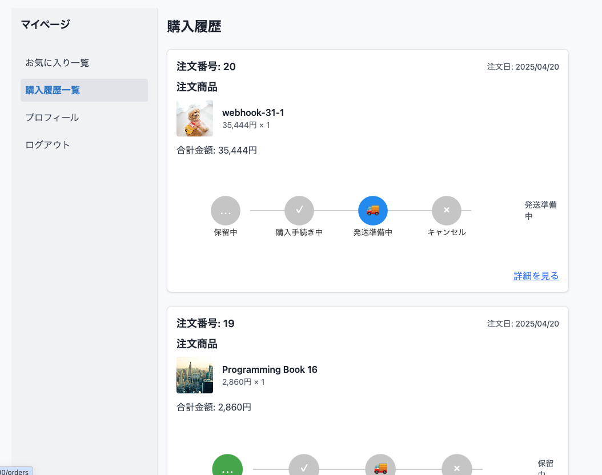

# Ecommerce-app
## URL
## 概要
チーム開発やソフトウェア開発を学ぶことを目的とした、ECサイトのデモアプリになります

##　技術スタック 
<table>
<tr>
 <th>カテゴリ</th>
 <th>技術スタック</th>
</tr>
<tr>
 <td rowspan=4>フロントエンド</td>
    　<td>HTML</td>
</tr>
<tr>
    <td> css </td>
</tr>
<tr>
    <td> CSSフレームワーク: Tailwind CSS </td>
</tr>
<tr>
    <td> JavaScript </td>
</tr>
<tr>
    <td rowspan=2>バックエンド</td>
    　<td>PHP 8.2</td>
</tr>
<tr>
 <td> フレームワーク: Laravel 11</td>
</tr>
<tr>
 <td rowspan=1>テスト</td>
　<td></td>
</tr>
<tr>
 <td rowspan=1>データベース</td>
　<td>MySQL 8.0 (AWS RDS)</td>
</tr>
<tr>
 <td rowspan=5>インフラ</td>
　<td>AWS EC2</td>
</tr>
<tr>
　<td>AWS RDS</td>
</tr>
<tr>
　<td>Docker</td>
</tr>
<tr>
　<td>Webサーバー: Nginx</td>
</tr>
<tr>
　<td>Mailサーバー: </td>
</tr>
<tr>
 <td rowspan=4>決済サービス</td>
　<td>Stripe (CLIを含む)</td>
</tr>
<tr>
　<td>Stripe WebHook</td>
</tr>
<tr>
　<td>Stripe CheckOut</td>
</tr>
<tr>
　<td>Laravel Cashier(Stripe)</td>
</tr>
<tr>
 <td> コンテナ</td>
　<td>Docker</td>
</tr>
<tr>
 <td>デザイン</td>
　<td>Figma</td>
</tr>
<tr>
 <td>CI/CD</td>
　<td>Github Actions</td>
</tr>

<tr>
<td rowspan=5>その他</td>
　<td>Git</td>
</tr>
</table>

<table>
<tr>
 <th>グループ</th>
 <th>機能</th>
</tr>
<tr>
 <td rowspan=2>アカウント</td>
    　<td>管理者、ユーザーのアカウント作成</td>
</tr>
<tr>
    　<td>ログイン、ログアウト</td>
</tr>

<td rowspan=8>ユーザー</td>
<tr>
    　<td>マイページ</td>
</tr>
<tr>
    　<td>購入履歴</td>
</tr>
<tr>
    　<td>お気に入り</td>
</tr>
<tr>
    　<td>メール通知</td>
</tr>
<tr>
    　<td>商品一覧</td>
</tr>
<tr>
    　<td>カート機能</td>
</tr>
<tr>
    　<td>商品購入</td>
</tr>

<td rowspan=6>管理者</td>
<tr>
    　<td>登録商品一覧</td>
</tr>
<tr>
    　<td>注文一覧</td>
</tr>
<tr>
    　<td>商品登録（新規作成）</td>
</tr>
<tr>
    　<td>商品情報の編集</td>
</tr>
<tr>
    　<td>商品削除</td>
</tr>

<td rowspan=5>Stripe</td>
<tr>
    　<td>商品新規作成(webhook):  
    Stripeのダッシュボードで商品を作成後、webhookでDBへ登録</td>
</tr>
<tr>
    　<td>決済機能(Stripe checkout):  
    Stipeの決済ページでカード番号等を入力し決済</td>
</tr>
<tr>
    　<td>商品情報の編集,削除(API): 
     編集内容をDBに反映、Stripe側の商品へもAPIで反映</td>
</tr>
</table>

## 解説
このアプリケーションは、出版社が自社運営するECサイトを想定して作成しました 
決済手段としてStripeを使用しています 
ダミーデータを使用してため、実際の購入や決済は出来ませんのでご注意ください。

### 注意事項

#### 商品購入時

デモサイトのためダミー情報を入力する必要があります。
カード情報には、以下の情報を手動でご入力してください。

| 項目 | 内容 |
| ------- | ------- |
| カード番号 | 4242 4242 4242 4242 |
| 有効期限(有効な将来の日付) | 12/34 |
| 任意の3桁のセキュリティーコード | 123 |

##### 参考

- [テストカードの使用方法](https://docs.stripe.com/testing?locale=ja-JP#use-test-cards)

### 流れと機能説明
本アプリケーションは一般的なECサイトと同様に、以下の流れで購入します
1. ログイン（ゲストで購入可）
2. 商品を選ぶ
3. カートに入れる
4. 購入手続きを行う

というのがメインの流れになります

#### 1. ログイン

マルチログイン機能になるため`ユーザー`と`管理者`それぞれでログインが可能です 
ユーザー、管理者それぞれの特徴は以下の通りです
- ユーザーはアカウント作成を行わなくても商品の購入が可能です 
- アカウントを持つ場合、購入履歴やお気に入り機能、住所登録による購入時の簡略が利用できます 
- 管理者はアカウントが必須になります

##### マルチログイン機能
ユーザー側と、管理者側でパスが異なります  
- ユーザー側: `/login`
- 管理者側:  `/admin/login`

###### ユーザー側

 
ログインに成功するとマイページに移動されます

###### 管理者側

 
ログインに成功すると管理者画面に移動されます

#### 2. 商品を選ぶ

###### トップページ 
トップページでは新刊、人気を表示

###### 商品一覧 

商品一覧では全ての商品を表示

###### 商品詳細
商品をクリックすると商品詳細を表示

###### お気に入り
商品の「お気に入り」をクリックするとマイページのお気に入りに追加

#### 3. カートにいれる 
###### カート 
商品を「カートに入れる」を選択するとカートページを表示しカートに追加 

#### 4. 購入手続きを行う
###### 購入手続きー配送先情報
カートページから「購入する」をクリックする、配送先情報の入力ページへ移動します 

ゲストの場合は、配送先を入力する必要があります

###### 購入手続き - 確認
配送先情報から「確認ページへ進む」で確認ページを表示

###### 購入手続き - 決済
確認ページから「購入する」をクリックするとStripeの決済ページに移動 
必要な情報を入力します 
このサイトでは上記に記載のダミーデータを入力します

###### 購入手続きー完了
カードの決済が完了すると自動的にECサイトに戻ります

###### ユーザーのマイページ
アカウントを持つユーザーはマイページから各種機能を利用できます
- お気に入り
商品のお気に入りをクリックするとお気に入りのリストに追加されます
- 購入履歴
過去に購入した商品の履歴と配送状態を確認できます
- プロフィール
各種情報を編集できます

マイページ

お気に入り

購入履歴
購入情報と配送情報

購入履歴詳細
stirpeの領収書発行ページへのリンクと詳細情報

###### 管理者画面
商品一覧
「商品の追加」でstripeのダッシュボードへ移動し商品を追加する 
- stripe webhookより商品情報を受け取りDBへ書き込みし、商品情報を取得
- 編集から商品情報の編集ページに移動
- 削除により商品を削除

 

商品詳細

 

注文一覧

## ソフトウェア設計
図の画像に関してはそれぞれのリンクから閲覧できます

#### ER図
※ サブスクリプションに関して実装ではリレーションしておりません  

[ER図](https://github.com/recoursion-backendAdvanced-team6/E-Commerce-backend/tree/staging/ecommerce-app/docs/diagrams/er.md)

#### アクティビティ図
管理者 - 商品に関するフロー
[アクティビティ図 - 管理者側](https://github.com/recoursion-backendAdvanced-team6/E-Commerce-backend/tree/staging/ecommerce-app/docs/diagrams/activity_admin.md)

- ユーザー　- 配送を除いた購入手続きまでのフロー
[アクティビティ図 - ユーザー側](https://github.com/recoursion-backendAdvanced-team6/E-Commerce-backend/tree/staging/ecommerce-app/docs/diagrams/activity_user.md)

#### シーケンス図
Stripeを利用した部分の商品の購入までの流れ

[シーケンス図 - 管理者側](https://github.com/recoursion-backendAdvanced-team6/E-Commerce-backend/tree/staging/ecommerce-app/docs/diagrams/sequence_admin.md)

[シーケンス図 - ユーザー側](https://github.com/recoursion-backendAdvanced-team6/E-Commerce-backend/tree/staging/ecommerce-app/docs/diagrams/sequence_admin.md)

#### 状態遷移図
購入処理における状態遷移図
[状態遷移図](https://github.com/recoursion-backendAdvanced-team6/E-Commerce-backend/tree/staging/ecommerce-app/docs/diagrams/state_user.md)