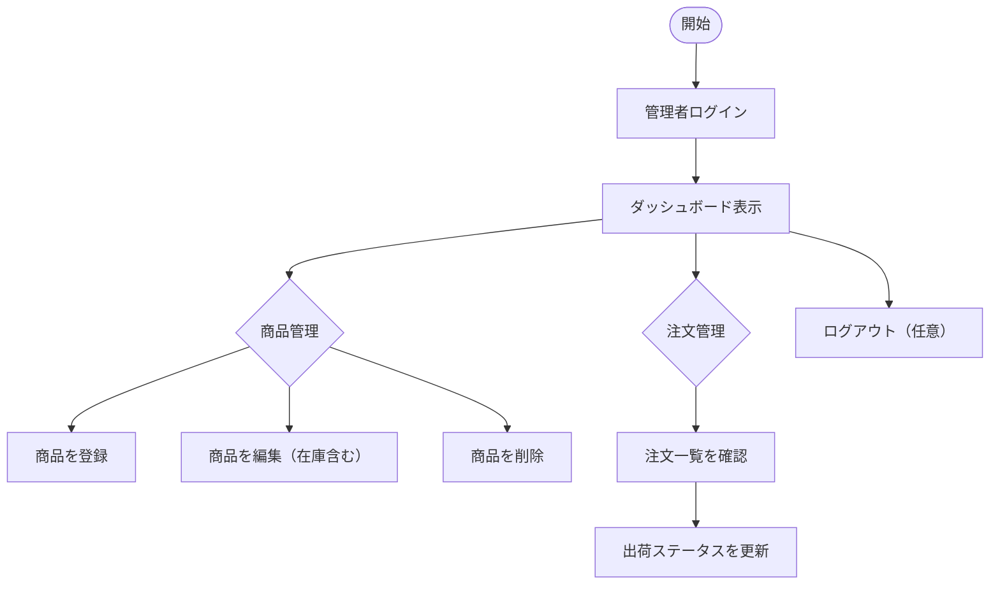

# アクティビティ図
 管理者 - 商品に関するフロー

```mermaid
flowchart TD
    Start([開始])
    
    Login[管理者ログイン]
    
    ShowDashboard[ダッシュボード表示]
    
    ManageProduct{商品管理}
    AddProduct[商品を登録]
    EditProduct[商品を編集（在庫含む）]
    DeleteProduct[商品を削除]
    
    CheckOrders{注文管理}
    ViewOrders[注文一覧を確認]
    UpdateStatus[出荷ステータスを更新]

    Logout[ログアウト（任意）]

    Start --> Login --> ShowDashboard
    
    ShowDashboard --> ManageProduct
    ManageProduct --> AddProduct
    ManageProduct --> EditProduct
    ManageProduct --> DeleteProduct

    ShowDashboard --> CheckOrders
    CheckOrders --> ViewOrders --> UpdateStatus

    ShowDashboard --> Logout

```