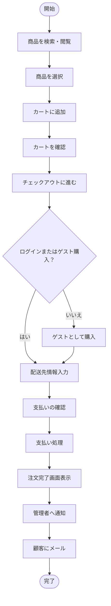

# アクティビティ図
ユーザー　- 配送を除いた購入手続きまでのフロー

```mermaid
flowchart TD
    Start([開始])
    
    Browse[商品を検索・閲覧]
    Select[商品を選択]
    AddToCart[カートに追加]
    
    ViewCart[カートを確認]
    ProceedCheckout[チェックアウトに進む]

    AuthCheck{ログインまたはゲスト購入？}
    Login[ゲストとして購入]
    
    InputShipping[配送先情報入力]
    PayCheck[支払いの確認]
    Pay[支払い処理]
    
    OrderSuccess[注文完了画面表示]
    NotifyAdmin[管理者へ通知]
    NotifyCustomer[顧客にメール]
    
    End([完了])

    Start --> Browse --> Select --> AddToCart --> ViewCart --> ProceedCheckout
    ProceedCheckout --> AuthCheck
    AuthCheck -- はい --> InputShipping
    AuthCheck -- いいえ --> Login --> InputShipping

    InputShipping -->  PayCheck --> Pay --> OrderSuccess --> NotifyAdmin --> NotifyCustomer --> End


```