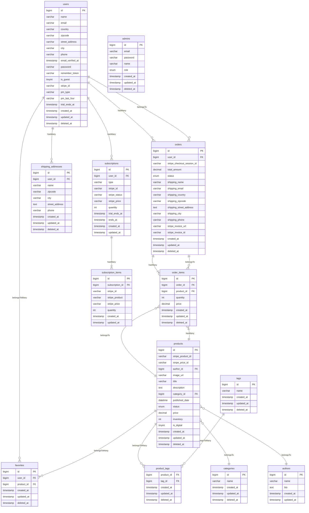

# ER図
※ サブスクリプションに関して実装ではリレーションしておりません

```mermaid
erDiagram
    users ||--o{ orders : hasMany
    orders }o--|| users : belongsTo

    users ||--o{ shipping_addresses : hasMany
    users ||--o{ subscriptions : hasMany

    users ||--o{ favorites : belongsToMany
    products ||--o{ favorites : belongsToMany

    orders ||--|{ order_items : hasMany
    order_items }o--|| orders : belongsTo

    products ||--|{ order_items : hasMany
    order_items }o--|| products : belongsTo

    products ||--o{ product_tags : belongsToMany
    tags ||--o{ product_tags : belongsToMany

    products }o--|| categories : belongsTo
    products }o--|| authors : belongsTo

    subscriptions ||--|{ subscription_items : hasMany

    products {
      bigint id PK
      varchar stripe_product_id
      varchar stripe_price_id
      bigint author_id FK
      varchar image_url
      varchar title
      text description
      bigint category_id FK
      datetime published_date
      enum status
      decimal price
      int inventory
      tinyint is_digital
      timestamp created_at
      timestamp updated_at
      timestamp deleted_at
    }

    orders {
      bigint id PK
      bigint user_id FK
      varchar stripe_checkout_session_id
      decimal total_amount
      enum status
      varchar shipping_name
      varchar shipping_email
      varchar shipping_country
      varchar shipping_zipcode
      text shipping_street_address
      varchar shipping_city
      varchar shipping_phone
      varchar stripe_invoice_url
      varchar stripe_invoice_id
      timestamp created_at
      timestamp updated_at
      timestamp deleted_at
    }

    order_items {
      bigint id PK
      bigint order_id FK
      bigint product_id FK
      int quantity
      decimal price
      timestamp created_at
      timestamp updated_at
      timestamp deleted_at
    }

    users {
      bigint id PK
      varchar name
      varchar email
      varchar country
      varchar zipcode
      varchar street_address
      varchar city
      varchar phone
      timestamp email_verified_at
      varchar password
      varchar remember_token
      tinyint is_guest
      varchar stripe_id
      varchar pm_type
      varchar pm_last_four
      timestamp trial_ends_at
      timestamp created_at
      timestamp updated_at
      timestamp deleted_at
    }

    admins {
      bigint id PK
      varchar email
      varchar password
      varchar name
      enum role
      timestamp created_at
      timestamp updated_at
      timestamp deleted_at
    }

    favorites {
      bigint id PK
      bigint user_id FK
      bigint product_id FK
      timestamp created_at
      timestamp updated_at
      timestamp deleted_at
    }

    categories {
      bigint id PK
      varchar name
      timestamp created_at
      timestamp updated_at
      timestamp deleted_at
    }

    authors {
      bigint id PK
      varchar name
      text bio
      timestamp created_at
      timestamp updated_at
    }

    tags {
      bigint id PK
      varchar name
      timestamp created_at
      timestamp updated_at
      timestamp deleted_at
    }

    product_tags {
      bigint product_id FK
      bigint tag_id FK
      timestamp created_at
      timestamp updated_at
      timestamp deleted_at
    }

    shipping_addresses {
      bigint id PK
      bigint user_id FK
      varchar name
      varchar zipcode
      varchar city
      text street_address
      varchar phone
      timestamp created_at
      timestamp updated_at
      timestamp deleted_at
    }

    subscriptions {
      bigint id PK
      bigint user_id FK
      varchar type
      varchar stripe_id
      varchar stripe_status
      varchar stripe_price
      int quantity
      timestamp trial_ends_at
      timestamp ends_at
      timestamp created_at
      timestamp updated_at
    }

    subscription_items {
      bigint id PK
      bigint subscription_id FK
      varchar stripe_id
      varchar stripe_product
      varchar stripe_price
      int quantity
      timestamp created_at
      timestamp updated_at
    }

```