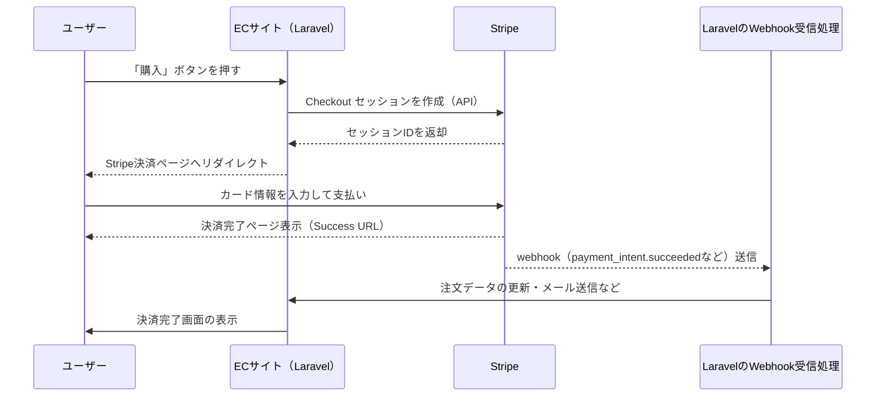

# シーケンス図
ユーザー側

Stripeを利用した部分の商品の購入までの流れ

```mermaid

sequenceDiagram
    participant User as ユーザー
    participant App as ECサイト（Laravel）
    participant Stripe as Stripe
    participant Webhook as LaravelのWebhook受信処理

    User->>App: 「購入」ボタンを押す
    App->>Stripe: Checkout セッションを作成（API）
    Stripe-->>App: セッションIDを返却
    App-->>User: Stripe決済ページへリダイレクト

    User->>Stripe: カード情報を入力して支払い
    Stripe-->>User: 決済完了ページ表示（Success URL）

    Stripe-->>Webhook: webhook（payment_intent.succeededなど）送信
    Webhook->>App: 注文データの更新・メール送信など
    App->>User: 決済完了画面の表示

```