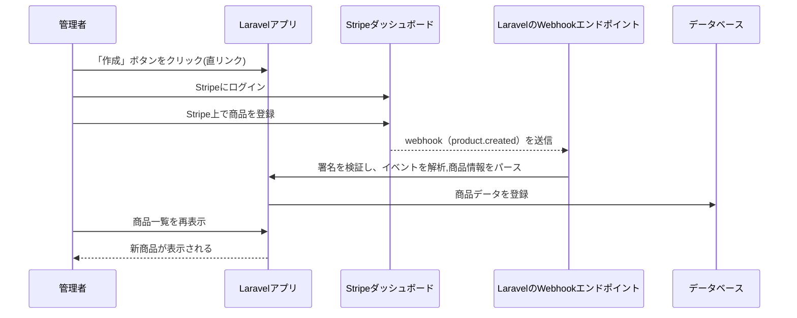

# シーケンス図
管理者側
Stripeを利用した部分の商品の購入までの流れ

```mermaid

sequenceDiagram
    participant Admin as 管理者
    participant App as Laravelアプリ
    participant Stripe as Stripeダッシュボード
    participant Webhook as LaravelのWebhookエンドポイント
    participant DB as データベース

    Admin->>App: 「作成」ボタンをクリック(直リンク)

    Admin->>Stripe: Stripeにログイン
    Admin->>Stripe: Stripe上で商品を登録

    Stripe-->>Webhook: webhook（product.created）を送信
    Webhook->>App: 署名を検証し、イベントを解析,商品情報をパース
    App->>DB: 商品データを登録

    Admin->>App: 商品一覧を再表示
    App-->>Admin: 新商品が表示される

```