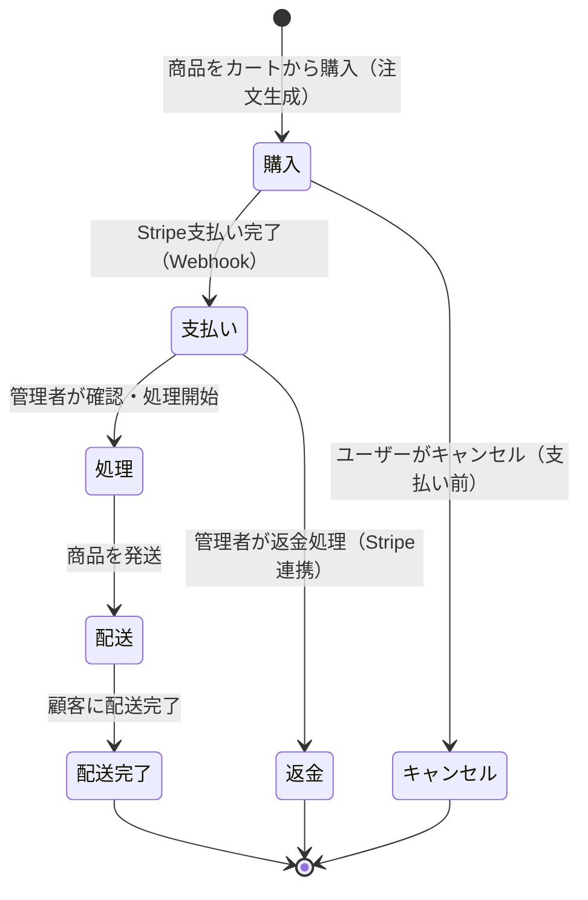

# 状態遷移図
購入処理における状態遷移図

```mermaid

stateDiagram-v2
    [*] --> 購入　: 商品をカートから購入（注文生成）

    購入　--> 支払い : Stripe支払い完了（Webhook）
    購入　--> キャンセル　: ユーザーがキャンセル（支払い前）

    支払い --> 処理　: 管理者が確認・処理開始
    処理　--> 配送: 商品を発送
    配送 --> 配送完了　: 顧客に配送完了

    支払い　--> 返金: 管理者が返金処理（Stripe連携）

    配送完了　--> [*]
    キャンセル　--> [*]
    返金　--> [*]

```